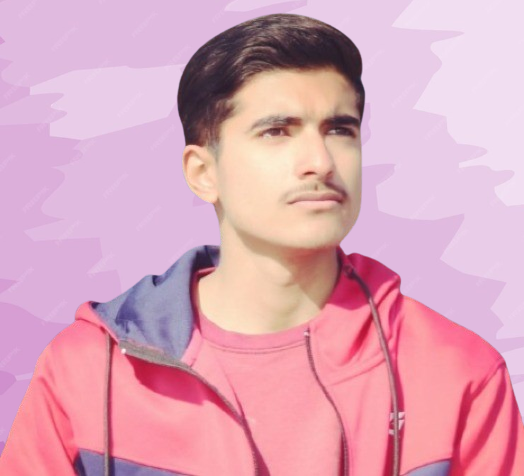
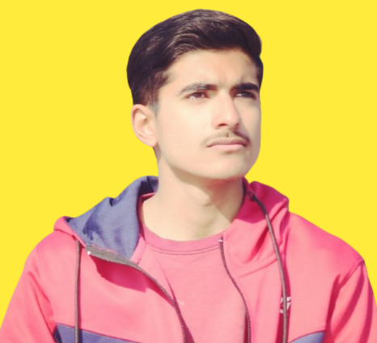

<h1 align="center">
  Hi there! 👋 I'm Muhammad Ahmad Sultan
</h1>

  

  

  <em>Engineering E2E intelligent solutions that bridge the gap between AI and real-world applications</em>

---

## 🧑‍💻 About Me

- 🌍 **Location:** Islamabad, Pakistan
- 🎓 **Education:** Software Engineering @ NUST | CGPA: 3.88/4.0
- 💼 **Current Role:** ML Engineer at Digital Perception (PVT.) LLP
- 🧠 **Experience:** 4+ years in AI/ML engineering & scalable web applications
- 💡 **Passion:** Building end-to-end intelligent solutions
- 📱 **Contact:** +92 306 1611301

---

## 🛠️ Technical Expertise & Skills

### 🤖 Machine Learning & Data Science

  
  
  
  
  
  
  

### 🌐 Web Development

  
  
  
  
  
  
  
  

### 🗄️ Databases & Storage

  
  
  
  
  

### ☁️ DevOps & Tools

  
  
  
  
  
  

### 🎯 AI/ML Frameworks & Libraries

  
  
  
  
  

### 🔍 Vector Databases & Knowledge Systems

  
  
  
  
  

### 🔧 Development Tools & IDEs

  
  
  
  
  

### 🎯 Core Programming Languages

  
  
  
  

### 🧠 Advanced AI Concepts

  
  
  
  
  

---

## 📊 GitHub Statistics

  
  

  

  

---

## 🏆 Certifications & Achievements

| 🎓 Certification | 🏛️ Institution | 🗓️ Year |
|-------------------|-----------------|----------|
| **Neo4j Certified Professional** | Neo4j GraphAcademy | 2025     |
| **Machine Learning Specialization** | DeepLearning.AI (Coursera) | 2024     |
| **Full-Stack Web Development** | Various Platforms | 2023     |
| **Docker Containerization** | Code with Mosh | 2024     |

### 🏅 Key Achievements
- 🚀 **99.9% System Uptime** maintained across multiple enterprise applications
- 📈 **60% reduction** in manual processing time through NLP automation
- 🎯 **98% client satisfaction rate** with 100% project delivery success
- 🏆 **Vice President** - Software Society, MCS Rawalpindi (2025-Present)

---

## 📈 Professional Experience

### 🏢 **Digital Perception (PVT.) LLP** - *Islamabad, Pakistan*
**ML Engineer (Entry-Level) | Software Developer** *(2022 - Present)*

- 🛠️ Engineered **5+ intelligent ML systems** using Python, TensorFlow, and LangChain
- 🌐 Architected robust backend services handling **1000+ daily requests** with **99.9% uptime**
- 🤖 Implemented NLP solutions reducing manual processing time by **60%**
- 🚀 Deployed MLOps pipelines improving model deployment efficiency by **50%**
- 👥 Led cross-functional teams delivering full-stack solutions

### 💼 **Freelance Ventures** - *Remote*
**MERN, Python, Java & C++ Developer** *(2021 - Present)*

- 📦 Delivered **10+ full-stack solutions** serving **1000+ users**
- ⚡ Optimized applications achieving **70% faster load times**
- 📱 Implemented responsive designs increasing mobile engagement by **45%**
- 💰 Consistently delivered projects **15% under budget**
- 🎯 Maintained **98% client satisfaction** rate

---

## 🎓 Education

### 🏛️ **National University of Sciences and Technology (NUST)**
**Bachelor of Software Engineering** | *2022 - 2026*
- 📊 **CGPA:** 3.88/4.0 (97%)
- 📚 **Relevant Coursework:** Data Structures & Algorithms, Machine Learning, Database Systems, Software Engineering, OOP, Web Technologies, Calculus, Linear Algebra, Statistics

### 🏫 **Divisional Public School and Inter College, Sahiwal**
- 🎓 **FSC Pre-Engineering:** 95.9% (2020-2022)
- 📜 **Matriculation:** 98% (2018-2020)

---

## 🌟 Leadership & Community

### 👨‍💼 Leadership Roles
- **Vice President** - Software Society, MCS Rawalpindi (2025-Present)
- **Course Representative** - BESE-28, NUST (Representing 120+ students)
- **Event Organizer** - 12+ technical events with $5000+ budgets
- **Cricket Team Captain** - DPS Sahiwal (Championship Winner)

### 🤝 Community Impact
- **5+ years** of volunteer work with various NGOs
- **Punjab Police Youth Internship** - Community outreach & policy research
- **500+ students** served through technical workshops
- **95% participant satisfaction** across organized events

---

## 🌍 Languages & Communication

| Language | Proficiency | Description |
|----------|-------------|-------------|
| 🇵🇰 **Urdu** | Native | Mother tongue |
| 🇵🇰 **Punjabi** | Native | Regional language |
| 🇺🇸 **English** | Fluent | Professional working proficiency |
| 🇩🇪 **German** | Intermediate | Conversational level |
| 🇹🇷 **Turkish** | Basic | Learning in progress |
| 🇸🇦 **Arabic** | Basic | Learning in progress |

---

## 📫 Let's Connect!

**📱 Phone:** +92-306-1611301  
**📍 Location:** Islamabad, Pakistan

---

## 💭 Personal Interests

🏃‍♂️ **Short Jogs & Running** | 🏏 **Cricket Enthusiast** | 📺 **Historical Series** | 🌱 **Gardening** | 📚 **Continuous Learning**

---

  
### 🚀 *"Engineering E2E Intelligence - One Solution at a Time"*

⭐ **I've contributed over **5 years** to community service while maintaining a **3.88 CGPA** and working professionally!

---

  

